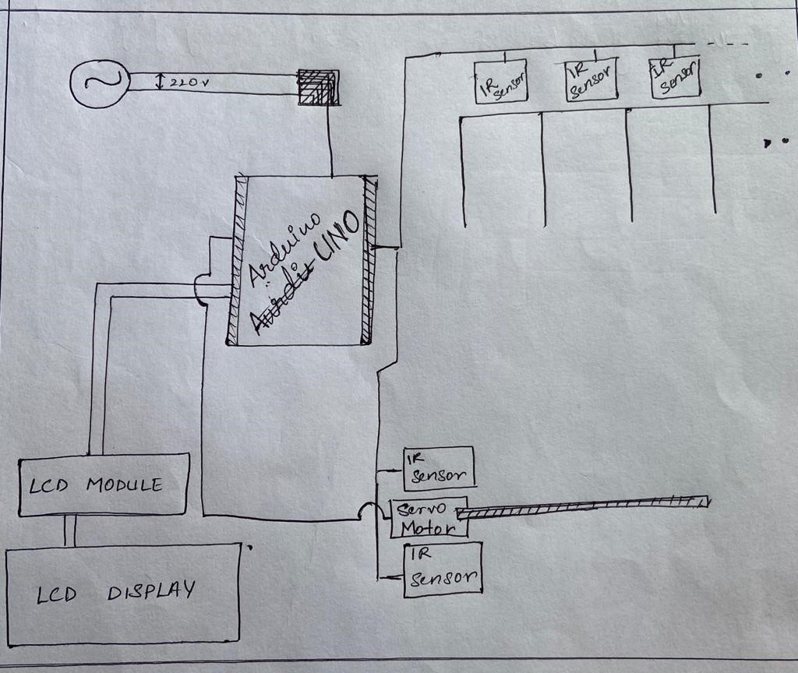

# Car Parking Simulator

## Overview

This project demonstrates a simple simulator for a car parking system. The model uses sensors to detect vehicle movement and allocates parking slots sequentially. The system uses Infrared (IR) sensors to detect the presence or absence of cars, and servo motors to simulate the parking gates. The parking lot has six slots, and the system checks which slots are available and automatically assigns a parking spot to the next car entering the lot. 

Additionally, sensors at the entrance and exit of the parking lot detect when a car enters or leaves, allowing the system to track the availability of parking spaces in real-time.

## Components Required

- **Arduino Uno**: Microcontroller to control the system.
- **20×4 LCD Display**: To display the status of the parking lot, including slot availability.
- **I2C LCD Module**: To interface the LCD with the Arduino using I2C protocol.
- **Male Header**
- **Female Header**
- **IR Sensor (x8)**: Used to detect car movement and presence in parking slots.
- **Mini Servo Motor SG-90**: Simulates the movement of parking gates.
- **Female DC Power Jack**
- **5V 2Amp Power Adapter**

## Features

- **Automated Parking Slot Assignment**: The system automatically assigns one of six available parking slots based on sensor input.
- **Sequential Parking**: Cars are parked in the available slots in a sequential order.
- **Motion Detection**: IR sensors are used to detect vehicle motion, allowing the system to determine if a car is entering or exiting the parking lot.
- **Real-Time Parking Updates**: The LCD display shows real-time parking slot availability and status.
- **Entry/Exit Detection**: Sensors are placed at the entry and exit points to detect cars entering and vacating the parking lot.

## How it Works

1. **Parking Slot Monitoring**: Each parking slot is monitored by an IR sensor. When a car is detected, the sensor sends a signal to the Arduino to indicate that the slot is occupied.
   
2. **Sequential Slot Allocation**: When a car enters the parking lot, the system checks which slot is available and assigns the car to the first free slot in the sequence.
   
3. **Entry/Exit Tracking**: The system uses two additional IR sensors to detect cars entering or leaving the parking lot. Based on the sensor input, the system updates the parking slot status.

4. **LCD Display**: The 20×4 LCD display shows the current status of each parking slot (occupied or available), as well as the number of free slots remaining.

## Power Supply

The system is powered by a 5V 2A DC power adapter connected via a female DC power jack.

## Wiring

- Connect the **IR sensors** to the respective pins on the Arduino for each parking slot and the entrance

## Circuit Diagram:

